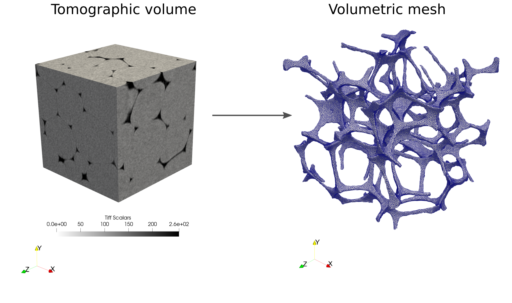
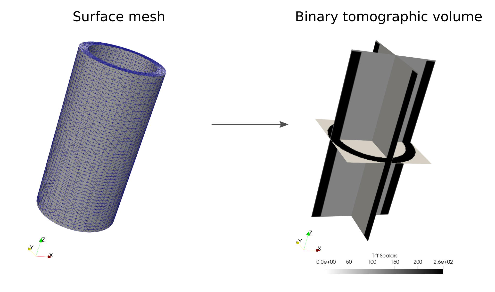

# Image-based-Meshing-Tools

This repository contains:
 
1. A script for meshing a segmented phase from a reconstructed tomographic volume using the **CGAL** volumetric mesher. 

  

 
2. A script for creating a virtual tomographic image/volume from a surface file (`.stl`). 

  

## Dependencies

- numpy
- scipy
- scikit-image (https://github.com/scikit-image/scikit-image)
- meshio (https://github.com/nschloe/meshio)

Requirements for image-based meshing :

 - CGAL python bindings (https://github.com/sciencectn/cgal-bindings) 

Reguirements for creating an image from a mesh :

 - Pymesh (https://github.com/PyMesh/PyMesh **or**
 - PyVista (https://github.com/pyvista)

 
## Other tools online 
You may be interested by other free open source tools available online:   

 - For creating an image from a mesh:   
   * stl-to-voxel (https://github.com/cpederkoff/stl-to-voxel) 
   * Insight toolkit (https://examples.itk.org/src/core/mesh/converttrianglemeshtobinaryimage/documentation)

 - For meshing:  
   * Voxel2Tet (https://github.com/CarlSandstrom/Voxel2Tet)  
   * Original CGAL project (https://github.com/CGAL)

